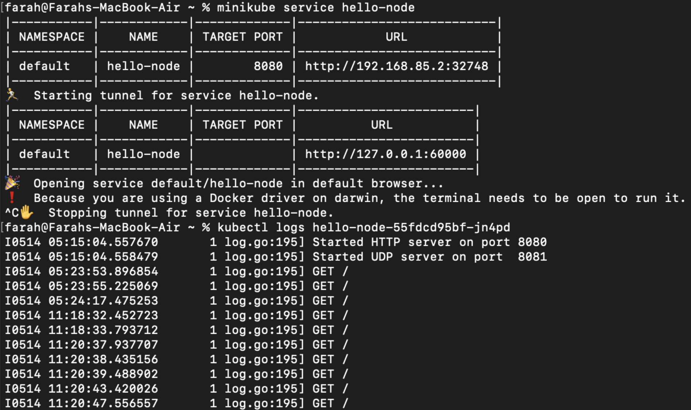

### Hello Minikube
###### 1. Compare the application logs before and after you exposed it as a Service. Try to open the app several times while the proxy into the Service is running. What do you see in the logs? Does the number of logs increase each time you open the app?
Terdapat perbedaan karena setelah service di-expose, service tersebut dapat menerima request. Hal ini menyebabkan log mencatat semua request yang masuk. Jadi, iya, setiap kali aplikasi dibuka sementara proxy ke service berjalan, jumlah log meningkat, mencatat setiap request yang masuk. Misalnya, jika service hello-node di refresh berkali-kali, log akan menunjukkan semua request yang pernah dilakukan.

###### 2. Notice that there are two versions of `kubectl get` invocation during this tutorial section. The first does not have any option, while the latter has `-n` option with value set to `kube-system`. What is the purpose of the `-n` option and why did the output not list the pods/services that you explicitly created?

Perbedaan antara kedua perintah `kubectl get` tersebut adalah penggunaan opsi  `-n`. Opsi  `-n` digunakan untuk menyatakan namespace tertentu, dalam hal ini `kube-system`. Hal ini diperlukan karena dalam Kubernetes, ada kemungkinan banyak service dengan nama yang sama tersebar di berbagai namespace. Dengan menggunakan  `-n`, kita memfokuskan perintah  `get` hanya pada namespace yang disebutkan setelah opsi `-n`. Itulah sebabnya output tidak menampilkan pods/service yang saya buat secara eksplisit jika mereka berada di namespace yang berbeda dari yang ditentukan dengan `-n`.