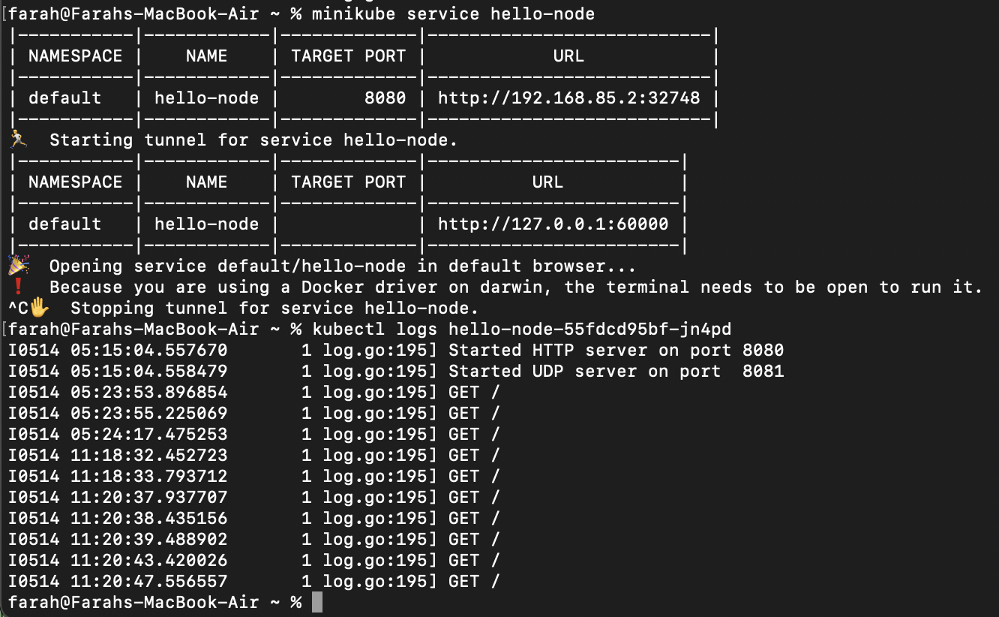
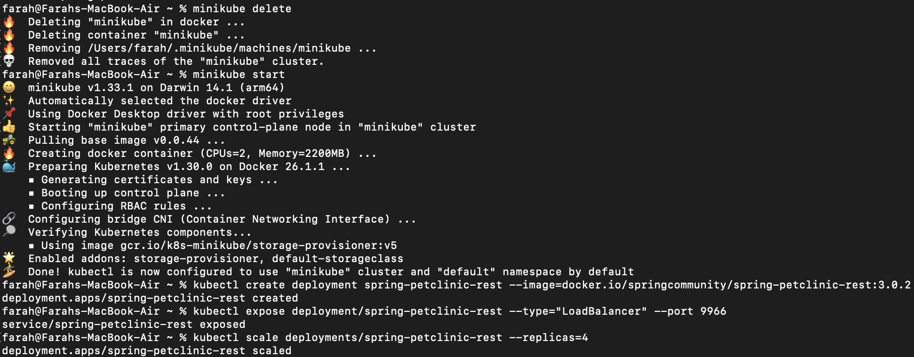
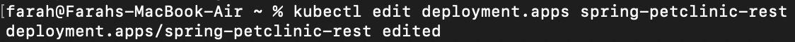
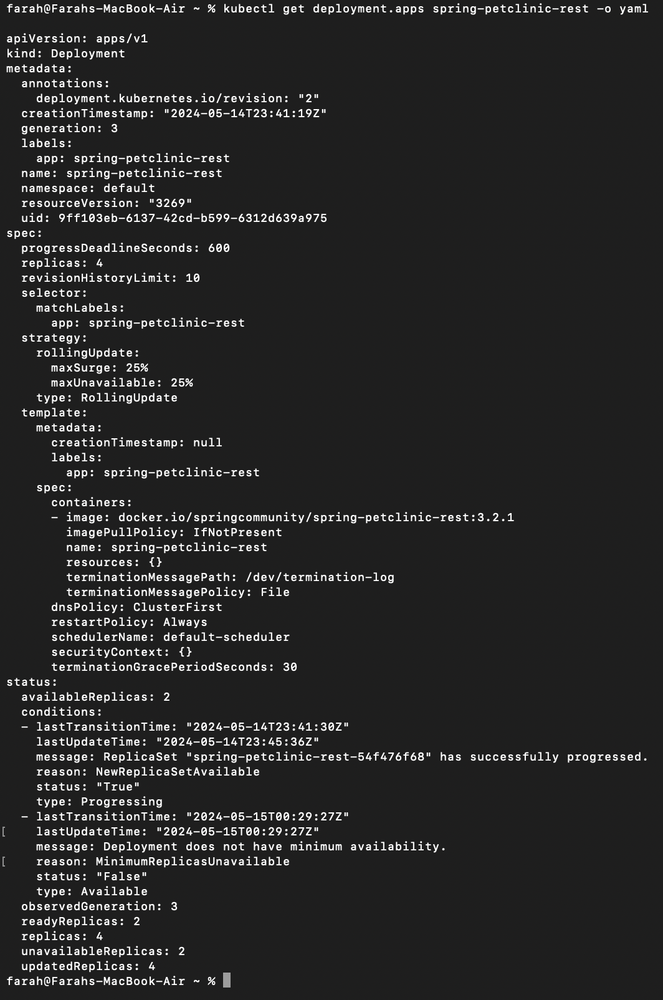
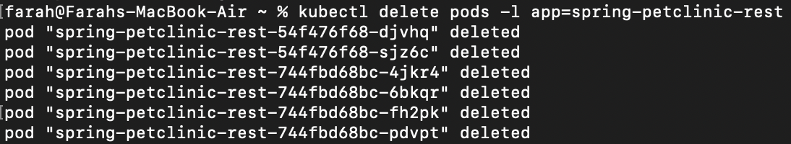
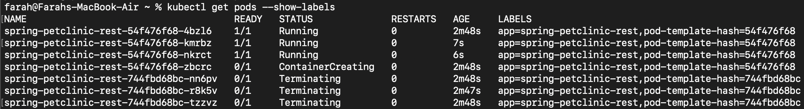
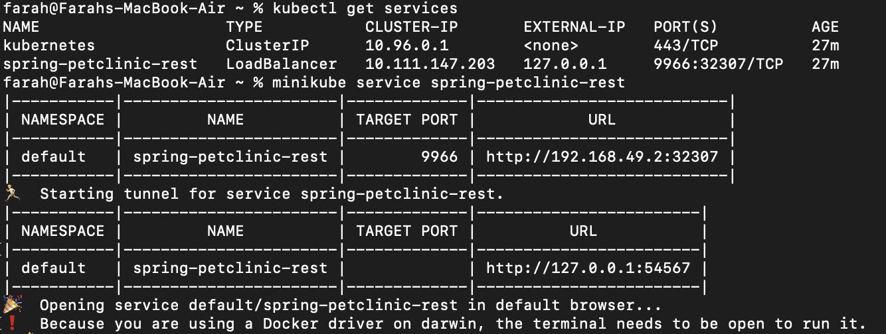
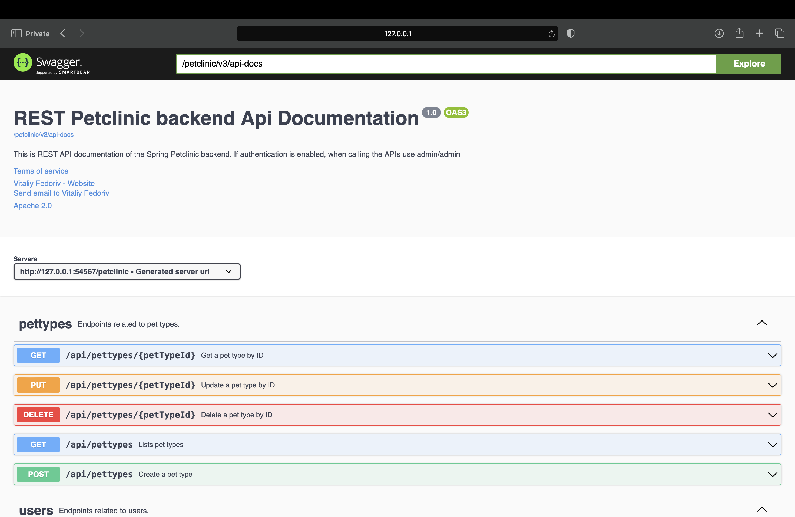
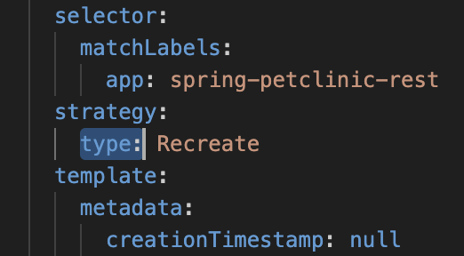
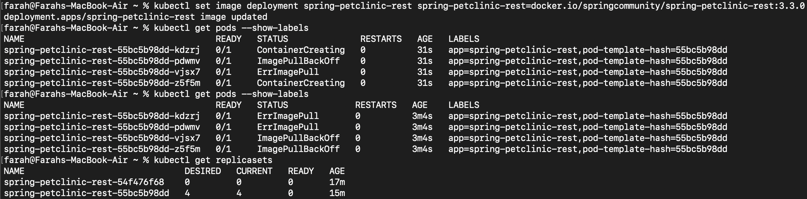

### Hello Minikube
###### 1. Compare the application logs before and after you exposed it as a Service. Try to open the app several times while the proxy into the Service is running. What do you see in the logs? Does the number of logs increase each time you open the app?
Terdapat perbedaan karena setelah service di-expose, service tersebut dapat menerima request. Hal ini menyebabkan log mencatat semua request yang masuk. Jadi, iya, setiap kali aplikasi dibuka sementara proxy ke service berjalan, jumlah log meningkat, mencatat setiap request yang masuk. Misalnya, jika service hello-node di refresh berkali-kali, log akan menunjukkan semua request yang pernah dilakukan.

###### 2. Notice that there are two versions of `kubectl get` invocation during this tutorial section. The first does not have any option, while the latter has `-n` option with value set to `kube-system`. What is the purpose of the `-n` option and why did the output not list the pods/services that you explicitly created?
Perbedaan antara kedua perintah `kubectl get` tersebut adalah penggunaan opsi  `-n`. Opsi  `-n` digunakan untuk menyatakan namespace tertentu, dalam hal ini `kube-system`. Hal ini diperlukan karena dalam Kubernetes, ada kemungkinan banyak service dengan nama yang sama tersebar di berbagai namespace. Dengan menggunakan  `-n`, kita memfokuskan perintah  `get` hanya pada namespace yang disebutkan setelah opsi `-n`. Itulah sebabnya output tidak menampilkan pods/service yang saya buat secara eksplisit jika mereka berada di namespace yang berbeda dari yang ditentukan dengan `-n`.

### Rolling Update & Kubernetes Manifest File
###### What is the difference between Rolling Update and Recreate deployment strategy?
Perbedaan utama antara strategi deployment Rolling Update dan Recreate adalah pada cara mereka menangani downtime selama proses pembaruan aplikasi. Pada strategi Recreate, aplikasi yang lama dihapus terlebih dahulu, kemudian versi yang baru dideploy. Hal ini menyebabkan adanya downtime karena aplikasi tidak tersedia saat proses penghapusan dan pemasangan ulang berlangsung. Sebaliknya, strategi Rolling Update memperbarui aplikasi secara bertahap. Pod lama diganti satu per satu dengan yang baru hingga semua pod diperbarui ke versi terbaru. Dengan cara ini, aplikasi tetap tersedia selama proses pembaruan, sehingga tidak ada downtime.

###### Try deploying the Spring Petclinic REST using Recreate deployment strategy and document your attempt.

Buat ulang springboot-petclinic-rest yang sudah di scale versi 3.0.2

Sifat dari ReplicaSet akan dimanfaatkan untuk menggantikan pod yang terhapus dengan template-nya. Template tersebut kemudian akan diperbarui ke versi yang baru sesuai dengan pengaturan berikutnya.

Periksalah keberhasilan perubahan query yang menghasilkan output seperti di bawah.

Setelah itu, delete pod

Dapat dilihat bahwa pod-pod yang baru sedang dibuat untuk menggantikan yang lama

Saat dijalankan, akan muncul seperti ini.

Jadi, dapat dinyatakan berhasil

###### Prepare different manifest files for executing Recreate deployment strategy.

File tersebut dapat diimpor ke Kubernetes seperti manifest file lainnya. Setelah itu, untuk membuktikan bahwa manifest file ini berguna, kita dapat mengubah image dalam file ke versi yang diinginkan. Hal ini akan menghapus pod dalam replica set yang lama dan kemudian mendepoy pod baru dalam replica set yang baru seperti yang ditunjukkan di bawah ini.

Jadi, jelas bahwa pembaruan dilakukan dengan strategi recreate dan bukan rolling update.

###### What do you think are the benefits of using Kubernetes manifest files? Recall your experience in deploying the app manually and compare it to your experience when deploying the same app by applying the manifest files (i.e., invoking `kubectl apply -f` command) to the cluster. 
Keuntungan utama menggunakan file manifest Kubernetes adalah efisiensi dan konsistensi. Dengan manifest file, kita tidak perlu mengingat atau mengetik ulang prosedur dan sintaks yang diperlukan untuk melakukan update atau deployment pertama kali. Hal ini mirip dengan mengimpor file pada docs, kita tidak perlu memahami detail pembuatan file tersebut, cukup menggunakan file tersebut. Penggunaan manifest file juga mengurangi kemungkinan terjadinya human error. Setiap service yang dibuat berdasarkan file manifest sudah pasti sesuai dengan spesifikasi yang ada dalam file tersebut, sehingga menghindari kesalahan yang mungkin terjadi jika mengetik sintaks secara manual satu per satu. Pengalaman ini jauh lebih mudah dan terorganisir dibandingkan dengan melakukan deployment secara manual.
